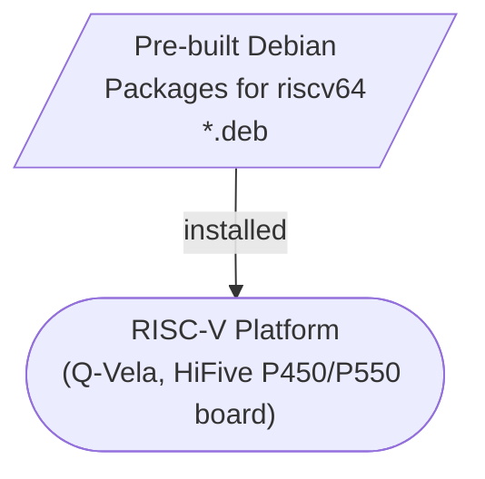

## 1. Vela-ROS 

risc-vela team built riscv64-compatible Debian packages from ROS 2 Jazzy package sources and riscv64-adapted repositories. You can install Prebuilt ROS2 Debian Packages to Q-Vela Emulation Environment.

- **Input:** ROS 2 Jazzy package sources and riscv64-adapted repositories
- **Build system:** `vela-ros`
- **Build artifacts:** riscv64 Debian package files (`.deb`)
- **Operational result:** An installed ROS 2 Jazzy environment for riscv64



## 2. Getting Started

### Prepare
The user have to boot Vela on the [`q-vela`](https://github.com/riscv-vela/q-vela) ahead and log in. Then, run the script below.
The log in script should output something like this:

```
q-vela login: vela
Welcome to Ubuntu 24.04 LTS (GNU/Linux 6.8.0-31-generic riscv64)

 * Documentation:  https://help.ubuntu.com
 * Management:     https://landscape.canonical.com
 * Support:        https://ubuntu.com/pro
vela@q-vela:~$
```
This confirms that the user is currently running with user privileges for the vela account.

### Update package information
User have to update package information from all coufigured sources by
```
$sudo apt update
```

Run prepare.sh once initially to set up the system for vela-ros.

```
$./prepare.sh
```

### Build and install ROS2

Run vela-ros for building and installing ros2.

```
$./vela-ros
```

To install specific packages in order, pass package names directly.

```
$./vela-ros ros-jazzy-rclcpp ros-jazzy-ros-base
```

It will take long times(about more than 6 hours). Please be patient.
