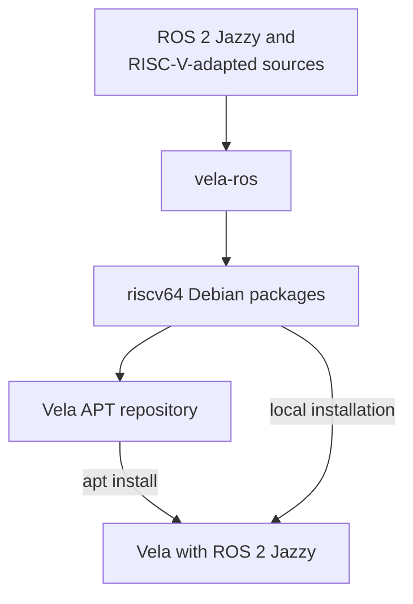

# Vela-ROS

`vela-ros` builds ROS 2 Jazzy source packages and RISC-V-adapted package
sources as Debian packages for Ubuntu 24.04 (Noble) on riscv64. The packages
built with this tool are published in the Vela APT repository.

You can either:

- install the published packages directly with APT, or
- run `vela-ros` to build and install the packages locally from source.



See [the build flow](build-flow.md) for the source repositories handled by
`vela-ros`, and [the built package list](built-packages.md) for the packages
currently published in the APT repository.

## Install published packages with APT

On the target Ubuntu machine, add the Vela APT repository and update the
package index:

```bash
echo 'deb [trusted=yes] http://vela.falinux.com/ubuntu noble main' | \
  sudo tee /etc/apt/sources.list.d/vela.list
sudo apt update
```

Then install ROS packages normally. APT downloads the packages already built
with `vela-ros` and resolves their dependencies:

```bash
sudo apt install ros-jazzy-ros-base
```

## Build and install locally with vela-ros

Use this method to reproduce the build manually on a riscv64 Ubuntu Noble
machine, such as a Vela system booted with
[`q-vela`](https://github.com/riscv-vela/q-vela).

Clone this repository on the target and prepare the build environment:

```bash
git clone -b noble https://github.com/riscv-vela/vela-ros.git
cd vela-ros
./prepare.sh
```

Build and install `ros-jazzy-ros-base` and its required packages:

```bash
./vela-ros
```

To build and install specific packages in order, pass their names directly:

```bash
./vela-ros ros-jazzy-rclcpp ros-jazzy-ros-base
```

Building the basic ROS 2 packages for RISC-V 64-bit can take more than 6 hours in an emulated environment or on a SiFive P550 board (around 199 packages).
Building extended ROS 2 packages for AMR applications—including SLAM, Nav2, and explore_lite—can take over 8 hours in an emulated environment or on a SiFive board,
depending on the user's software competence (around 430 packages). 
Consequently, the total build time (more than 14 hours combined) depends on the number of CPU cores, network speed, and whether SATA or NVMe storage is used.
