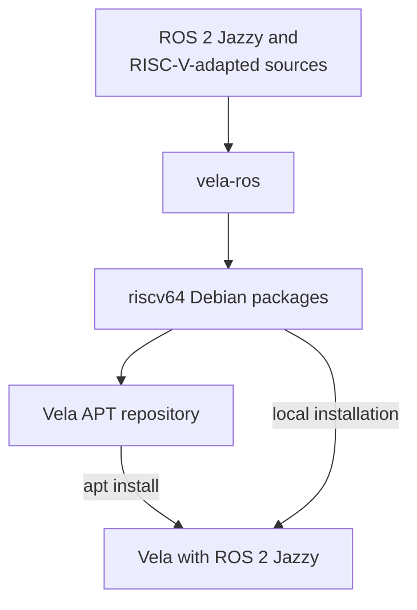

# Vela-ROS

`vela-ros` builds ROS 2 Jazzy source packages and RISC-V-adapted package
sources as Debian packages for Ubuntu 24.04 (Noble) on riscv64. The packages
built with this tool are published in the Vela APT repository.

You can either:

- install the published packages directly with APT, or
- run `vela-ros` to build and install the packages locally from source.



See [the build flow](build-flow.md) for the source repositories handled by
`vela-ros`, and [the built package list](built-packages.md) for the packages
currently published in the APT repository.

## Install published packages with APT

On the target Ubuntu machine, add the Vela APT repository and update the
package index:

```bash
echo 'deb [trusted=yes] http://vela.falinux.com/ubuntu noble main' | \
  sudo tee /etc/apt/sources.list.d/vela.list
sudo apt update
```

Then install ROS packages normally. APT downloads the packages already built
with `vela-ros` and resolves their dependencies:

```bash
sudo apt install ros-jazzy-ros-base
```

## Build and install locally with vela-ros

Use this method to reproduce the build manually on a riscv64 Ubuntu Noble
machine, such as a Vela system booted with
[`q-vela`](https://github.com/riscv-vela/q-vela).

Clone this repository on the target and prepare the build environment:

```bash
git clone -b noble https://github.com/riscv-vela/vela-ros.git
cd vela-ros
./prepare.sh
```

Build and install `ros-jazzy-ros-base` and its required packages:

```bash
./vela-ros
```

To build and install specific packages in order, pass their names directly:

```bash
./vela-ros ros-jazzy-rclcpp ros-jazzy-ros-base
```

ROS2 base(basic) package build with RiscV64 can take more than 6 hours in the emulated and P550(about 199 pkgs).
Extended ROS2 packagefor AMR app with SLAM, NAV2, explore-lite can take more than 8 hours plus in the emulated env or sifive board depends on user's software competence. (about 430 pkgs).
Total installation time(more than 6+8 hours) depends on the number of populated CPU core, the network speed, sata or NVMe storage usage. 
