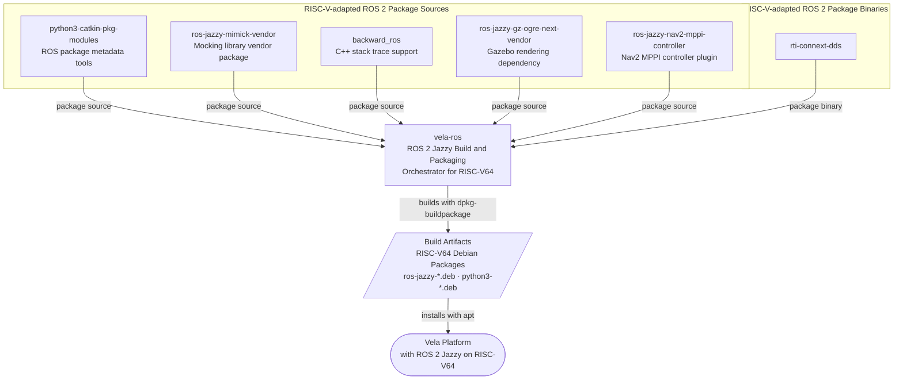

## Relationship Between `vela-ros` and RISC-V-adapted ROS Packages

The following repositories provide RISC-V-adapted package sources that are consumed and built by `vela-ros`.

### Relationship

- The five repositories are not Git submodules of `vela-ros`.
- They provide customized or RISC-V64-adapted package sources.
- `vela-ros` clones and builds these sources when required.
- The direct build outputs are RISC-V64 Debian package files.
- Installing the generated packages creates the Vela ROS 2 Jazzy runtime environment.
