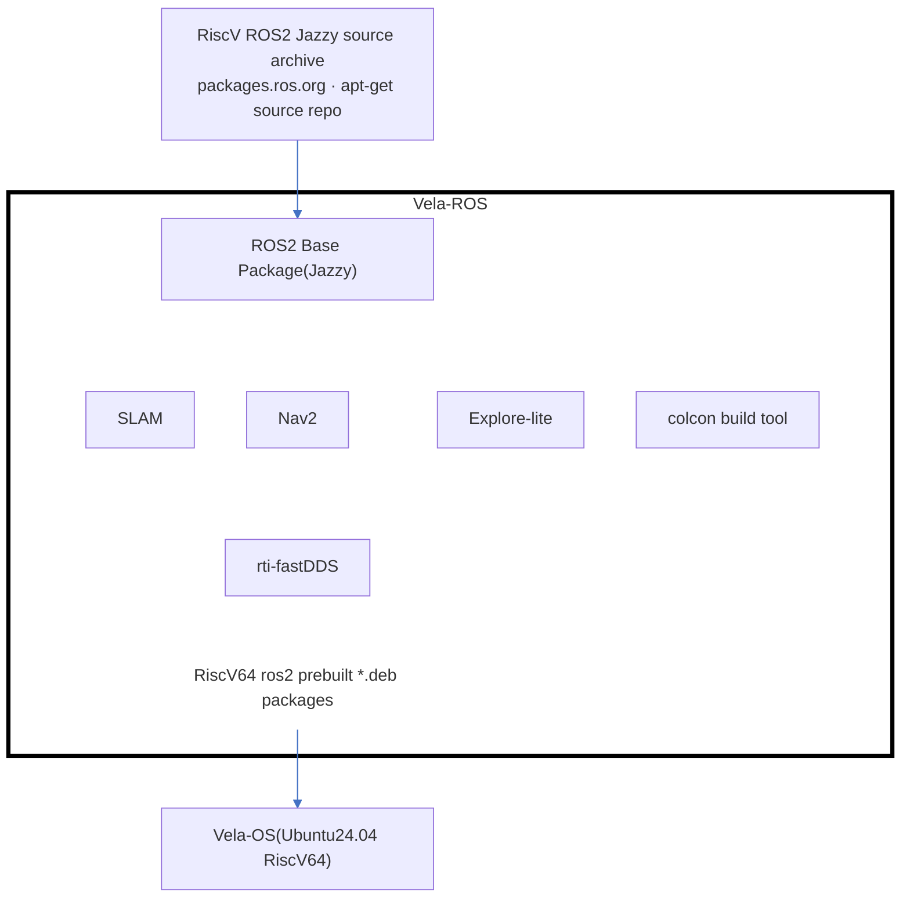

## Vela-ROS Package Composition

`vela-ros` packages the ROS 2 Jazzy stack for riscv64 out of the upstream source archive, then installs the resulting Debian packages onto the Vela platform.

### Summary

1. `vela-ros` rebuilds the full ROS 2 Jazzy stack for riscv64 from the upstream `packages.ros.org` source archive via `apt-get source`.
2. The Vela-ROS build set spans core middleware (DDS), the ROS 2 base packages, and the navigation/mapping stack (Nav2, SLAM, Explore-lite).
3. `colcon` is the underlying build tool driving the per-package Debian packaging pipeline.
4. Every component is compiled into riscv64-native, prebuilt `*.deb` packages. 
5. The resulting packages are installed onto Vela-OS (Ubuntu 24.04, riscv64), producing a ready-to-run ROS 2 Jazzy robotics environment.
